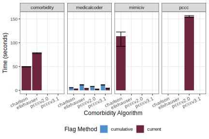

```{r}
#| label: setup
#| include: false
library(data.table)
library(medicalcoder)
options("datatable.print.topn" = 3)
mimiciv <- arrow::read_feather("mimiciv.feather")
data.table::setDT(mimiciv)
```

## Two Objectives

1. Introduce the medicalcoder R package

2. Opine on design constraints and building portable software packages

# medicalcoder

## Have you ever...

* Worked with ICD-9 and ICD-10 data?
* Assessed Charlson or Elixhauser comorbidities?
* Assessed Pediatric Complex Chronic Conditions (PCCC)?
* Been concerned about present-on-admission flags?
* Primary verse secondary diagnosis?
* Needed a __longitudinal__ patient context?

::: {.notes}
:::

## If you answered yes to any of those questions...

_medicalcoder_ provides needed utilities to support your work

* Designed for real-world EHR data
  * mixed ICD-9 and ICD-10
  * full and compact code formats
  * present-on-admission and primary diagnosis indicators
  * longitudinal patient context
  * Comorbidity Algorithms
    * Three families: Charlson, Elixhauser, and PCCC
    * Multiple variants of each

::: {.notes}
* medicalcoder has a full internal ICD database
:::

## Example Data: MIMIC-IV v3.1

```{r}
#| label: show-mimiciv-data
#| echo: true
#| dependson: "setup"
mimiciv
```

::: {style="font-size: 0.7em;"}

| Column         | Description                                        | Source                |
| :--            | :------                                            | :--                   |
| `subject_id`   | subject identifier                                 | MIMIC-IV              |
| `encounter`    | Encounter Sequence within `subject_id`             | constructed           |
| `age`          | Age, in years, at admission                        | MIMIC-IV; constructed |
| `icd_code`     | ICD code                                           | MIMIC-IV              |
| `icd_version ` | ICD version integer value 9 or 10                  | MIMIC-IV              |
| `dx`           | Indicator for diagnostic (1) or procedure (0) code | MIMIC-IV; constructed |
| `poa`          | Present-on-admission flag                          | constructed           |
| `pdx`          | Primary diagnosis flag                             | constructed           |

:::

::: {style="font-size: 0.5em;"}

---

Get access to the MIMIC-IV v3.1 data: https://physionet.org/content/mimiciv/3.1/

:::

::: {.notes}
* De-identified health data from patients admitted to intensive care
  units at Beth Israel Deaconess Medical Center.

* ICD-9 and ICD-10 diagnostic and procedure codes available for comorbidity
  research.

* Some of the columns I created

* You can review the specific code for this work on github, link on the final
  slide
:::

## Example Data: MIMIC-IV v3.1

```{r}
#| label: mixed-icd-in-mimiciv
#| echo: false
#| output: asis
#| dependson: "setup"

# how many subjects have both ICD-9 and ICD-10 codes?
s <-
  mimiciv[
    ,
    .(
      icdv =
        data.table::fcase(
          all(is.na(icd_version)),               "No ICD codes",
          all(icd_version ==  9L, na.rm = TRUE), "ICD-9 Only",
          all(icd_version == 10L, na.rm = TRUE), "ICD-10 Only",
          any(icd_version ==  9L, na.rm = TRUE) & any(icd_version == 10L, na.rm = TRUE), "Both ICD-9 and ICD-10"
        )
    )
    ,
    by = .(subject_id)
   ][
   , .(subjects = data.table::uniqueN(subject_id)), keyby = .(icdv)
   ][
   , sp := sprintf("%0.1f%%", 100 * subjects / sum(subjects))
   ][
   , s := qwraps2::frmt(subjects)
   ]

# how many encounters have both ICD-9 and ICD-10 codes?
e <-
  mimiciv[
    ,
    .(
      icdv =
        data.table::fcase(
          all(is.na(icd_version)),               "No ICD codes",
          all(icd_version ==  9L, na.rm = TRUE), "ICD-9 Only",
          all(icd_version == 10L, na.rm = TRUE), "ICD-10 Only",
          any(icd_version ==  9L, na.rm = TRUE) & any(icd_version == 10L, na.rm = TRUE), "Both ICD-9 and ICD-10"
        )
    )
    ,
    by = .(subject_id, encounter)
   ][
   , .(encounters = data.table::uniqueN(.SD, by = c("subject_id", "encounter"))), keyby = .(icdv)
   ][
   , ep := sprintf("%0.3f%%", 100 * encounters / sum(encounters))
   ][
   , e := qwraps2::frmt(encounters)
   ]

tab <-
  rbind(
    merge(s, e, by = "icdv")[, .(icdv, s, sp, e, ep)],
    data.table::data.table(
      icdv = "Totals:",
      "s" = qwraps2::frmt(data.table::uniqueN(mimiciv, by = c("subject_id"))),
      "sp" = "",
      "e" = qwraps2::frmt(data.table::uniqueN(mimiciv, by = c("subject_id", "encounter"))),
      "ep" = ""
    )
  )

kableExtra::kbl(
  x = tab,
  format = "html",
  col.names = c("", "N", "%", "N", "%"),
  align = "lrrrr"
) |>
kableExtra::kable_styling(
  bootstrap_options = c("striped")
) |>
kableExtra::add_header_above(c("", "Subjects" = 2, "Encounters" = 2)) |>
kableExtra::row_spec(5, bold = TRUE)
```

`r qwraps2::frmt(nrow(mimiciv))` total rows

## Encounter-level vs Longitudinal Flagging of Comorbidities
```{r}
#| label: charlson-comorbidities-call-current
#| include: false
#| cache: true
#| dependson: "setup"
charlson_encounterlevel_quan2005 <-
  medicalcoder::comorbidities(
    data        = mimiciv,
    icd.codes   = "icd_code",
    method      = "charlson_quan2005",
    id.vars     = c("subject_id", "encounter"),
    icdv.var    = "icd_version",
    dx.var      = "dx",
    poa         = 1,
    age.var     = "age",
    primarydx   = 0,
    flag.method = "current" # Default
  )
```

```{r}
#| label: charlson-comorbidities-call-cumulative
#| include: false
#| cache: true
#| dependson: "setup"
charlson_longitudinal_quan2005 <-
  medicalcoder::comorbidities(
    data        = mimiciv,
    icd.codes   = "icd_code",
    method      = "charlson_quan2005",
    id.vars     = c("subject_id", "encounter"),
    icdv.var    = "icd_version",
    dx.var      = "dx",
    poa         = 1,
    age.var     = "age",
    primarydx   = 0,
    flag.method = "cumulative"
  )
```

```{r}
#| label: elixhauser-quan2005-current
#| include: false
#| cache: true
#| dependson: "setup"
elixhauser_encounterlevel_quan2005 <-
  medicalcoder::comorbidities(
    data        = mimiciv,
    icd.codes   = "icd_code",
    method      = "elixhauser_quan2005",
    id.vars     = c("subject_id", "encounter"),
    icdv.var    = "icd_version",
    dx.var      = "dx",
    poa         = 1,
    primarydx   = 0,
    flag.method = "current"
  )
```
```{r}
#| label: elixhauser-quan2005-cumulative
#| include: false
#| cache: true
#| dependson: "setup"
elixhauser_longitudinal_quan2005 <-
  medicalcoder::comorbidities(
    data        = mimiciv,
    icd.codes   = "icd_code",
    method      = "elixhauser_quan2005",
    id.vars     = c("subject_id", "encounter"),
    icdv.var    = "icd_version",
    dx.var      = "dx",
    poa         = 1,
    primarydx   = 0,
    flag.method = "cumulative"
  )
```

```{r}
#| label: cdelta
#| echo: false
#| cache: true
#| dependson: ["charlson-comorbidities-call-current", "charlson-comorbidities-call-cumulative", "elixhauser-quan2005"]
cdelta <-
  data.table::rbindlist(
    list(
      "Charlson__Encounter-level"   = charlson_encounterlevel_quan2005,
      "Charlson__Longitudinal"      = charlson_longitudinal_quan2005,
      "Elixhauser__Encounter-level" = elixhauser_encounterlevel_quan2005,
      "Elixhauser__Longitudinal"    = elixhauser_longitudinal_quan2005
    ),
    idcol = "set",
    use.names = TRUE,
    fill = TRUE
  )
cdelta[, c("method", "flag.method") := data.table::tstrsplit(set, "__")]
cdelta[, set := NULL]

# encounters with at least one comorbidity
cdelta[, .(n = sum(cmrb_flag), p = mean(cmrb_flag)), by = .(method, flag.method)] |>
  ggplot2::ggplot() +
  ggplot2::aes(x = method, fill = flag.method, y = n) +
  ggplot2::geom_col(position = ggplot2::position_dodge()) +
  ggplot2::scale_y_continuous(
    name = "Number of Encounters with at least one comorbidity",
    label = scales::label_comma(),
    sec.axis = ggplot2::sec_axis(
      name = "Percent of Encounters at least one comorbidity",
      transform = ~ . / nrow(unique(mimiciv, by = c("subject_id", "encounter"))),
      breaks = seq(0, 1, by = 0.1),
      label = scales::label_percent()
    )
  ) +
  ggplot2::scale_fill_manual(
    name = "Flag Method",
    values = c("Encounter-level" = "#6F263D", "Longitudinal" = "#4F8FCB")
  ) +
  ggplot2::theme_bw() +
  ggplot2::theme(
    axis.title.x = ggplot2::element_blank(),
    legend.position = "bottom"
  )
```

```{r}
#| label: cdelta-long
#| include: false
#| cache: true
#| dependson: "cdelta"
cdelta_long <-
  data.table::melt(
    cdelta,
    id.vars = c("method", "flag.method", "subject_id", "encounter"),
    na.rm = TRUE
  )
cdelta_long <- cdelta_long[!(variable %in% c("age_score", "num_cmrb", "cci", "cmrb_flag", "readmission_index", "mortality_index", "HTN_C"))]
cdelta_long <- cdelta_long[, .(count = sum(value)), by = .(method, flag.method, variable)]
```

::: {style="font-size: 0.5em;"}

---

Quan, Hude, et al. "Coding algorithms for defining comorbidities in ICD-9-CM and ICD-10 administrative data." Medical care 43.11 (2005): 1130-1139. DOI: 10.1097/01.mlr.0000182534.19832.83

:::

## Diabetes

```{r}
#| label: dmplot
#| echo: false
#| cache: true
#| dependson: "cdelta"
#| fig-width: 12
#| fig-height: 6
g1 <-
  ggplot2::ggplot(
  cdelta_long[variable %in% c("dm", "dmc", "DM", "DMCX")][,
    .(flag.method, method, count,
      variable = data.table::fifelse(variable %in% c("dm", "DM"),
        "Diabetes\nwithout complications", "Diabetes\nwith complications"))]
  ) +
  ggplot2::aes(x = variable, fill = flag.method, y = count) +#, color = variable) +
  ggplot2::geom_col(linewidth = 3, position = ggplot2::position_dodge()) +
  ggplot2::facet_wrap( ~ method) +
  ggplot2::scale_y_continuous(
    name = "Number of Encounters",
    label = scales::label_comma()
  ) +
  ggplot2::scale_fill_manual(
    name = "Flag Method",
    values = c("Encounter-level" = "#6F263D", "Longitudinal" = "#4F8FCB")
  ) +
  ggplot2::theme_bw() +
  ggplot2::theme(
    axis.title.x = ggplot2::element_blank(),
    legend.position = "bottom"
  )

s10009326 <-
  data.table::melt(
    cdelta[subject_id == "10009326"],
    id.vars = c("encounter", "method", "flag.method"),
    measure.vars = c("dm", "dmc", "DM", "DMCX"),
    variable.factor = FALSE
  )

s10009326[, variable := data.table::fifelse(variable %in% c("dm", "DM"),
  "Diabetes\nwithout\nComplications", "Diabetes\nwith\nComplications")]

s10009326 <- s10009326[value == 1]

g2 <-
  ggplot2::ggplot(s10009326) +
  ggplot2::aes(x = encounter, y = flag.method, fill = flag.method) +
  ggplot2::geom_tile(color = "white") +
  ggplot2::scale_x_continuous(breaks = seq(1, max(s10009326$encounter), by=1)) +
  ggh4x::facet_nested(method + variable ~ ., scales = "free_y")  +
  ggplot2::scale_fill_manual(
    name = "Flag Method",
    values = c("Encounter-level" = "#6F263D", "Longitudinal" = "#4F8FCB")
  ) +
  ggplot2::theme_bw() +
  ggplot2::theme(
    axis.text.y = ggplot2::element_blank(),
    axis.ticks.y = ggplot2::element_blank(),
    axis.title.y = ggplot2::element_blank(),
    panel.grid.minor = ggplot2::element_blank(),
    legend.title = ggplot2::element_blank(),
    legend.position = "bottom"
  ) +
  ggplot2::ggtitle("subject id 10009326")

ggpubr::ggarrange(g1, g2, nrow = 1, common.legend = TRUE, legend = "bottom")
```


```{r}
#| label: ahrq2026current
#| include: false
#| cache: true
#| dependson: "setup"
ahrq2026current <-
  medicalcoder::comorbidities(
    data          = mimiciv,
    icd.codes     = "icd_code",
    id.vars       = c("subject_id", "encounter"),
    icdv.var      = "icd_version",
    dx.var        = "dx",
    poa.var       = "poa",
    primarydx.var = "pdx",
    method        = "elixhauser_ahrq2026",
    flag.method   = "current" # Encounter-level
  )
```
```{r}
#| label: ahrq2026cumulative
#| include: false
#| cache: true
#| dependson: "setup"
ahrq2026cumulative <-
  medicalcoder::comorbidities(
    data          = mimiciv,
    icd.codes     = "icd_code",
    id.vars       = c("subject_id", "encounter"),
    icdv.var      = "icd_version",
    dx.var        = "dx",
    poa.var       = "poa",
    primarydx.var = "pdx",
    method        = "elixhauser_ahrq2026",
    flag.method   = "cumulative" # Longitudinal, sort within subject_id by encounter
  )
```
```{r}
#| label: ahrq2026delta
#| include: false
#| cache: true
#| dependson: ["ahrq2026current", "ahrq2026cumulative"]
ahrq2026delta <-
  merge(
    x = ahrq2026current,
    y = ahrq2026cumulative,
    all = TRUE,
    by = c("subject_id", "encounter"),
    suffixes = c("_current", "_cumulative")
  )
```

## Elixhauser per AHRQ

* [Agency for Healthcare Research and Quality](https://www.ahrq.gov/) (AHRQ)
* Present-on-admission is _required_ for _some_ conditions/ICD codes
* Example:
  * K76.0: Fatty (change of) liver, not elsewhere classified
  * Maps to mild liver disease
  * Must be present-on-admission to flag the comorbidity

::: {.notes}
That is, if K76.0 occurs during encounter 1, the patient does not get flagged as
having mild liver disease as the condition could arise during acute care.
:::

## Subject 19997538:
* 3 encounters
* K76.0 is reported, not present-on-admission, on encounter 1

```{r}
#| label: show-s19997538-liver-disease
#| echo: true
#| output: true
mimiciv[subject_id == 19997538, max(encounter)]
mimiciv[subject_id == 19997538 & icd_code == "K760"]
```

```{r}
#| label: K760-get-icd-codes
#| include: false
#| code-fold: true
#| code-summary: get_icd_codes()
subset(
  medicalcoder::get_icd_codes(with.description = TRUE),
  code == "K760"
)
```

```{r}
#| label: K760-get-elixhauser-codes()
#| include: false
#| code-fold: true
#| code-summary: get_elixhauser_codes()
subset(
  x      = medicalcoder::get_elixhauser_codes(),
  subset = code == "K760" & elixhauser_ahrq2026 == 1L,
  select = c("icdv", "dx", "full_code", "code", "poaexempt", "condition", "elixhauser_ahrq2026")
)
```

* Results from `medicalcoder`

```{r}
#| label: show-s19997538-liver-disease-part-2
#| echo: false
#| output: asis
#| cache: true
#| dependson: ["ahrq2026current", "ahrq2026cumulative"]
keep <- c("subject_id", "encounter", "LIVER_MLD")
merge(
  x = ahrq2026current[subject_id == 19997538, .SD, .SDcols = keep],
  y = ahrq2026cumulative[subject_id == 19997538, .SD, .SDcols = keep],
  all =  TRUE,
  by = c("subject_id", "encounter"),
  suffixes = c("  Encounter-level", "  Longitudinal")
) |>
gt::gt()
```

* Simple encounter level carry-forward will fail to flag the mild liver disease


## The Point:

* Encounter-level flagging of comorbidities will

  * Under count conditions

  * Misclassify disease severity

  * Fail to flag some conditions entirely

* Carry-forward of an encounter-level flag is insufficient for flagging
  comorbidities in longitudinal data

## `medicalcoder::comorbidities()` {auto-animate=true}

## `medicalcoder::comorbidities()` {auto-animate=true}

```r
medicalcoder::comorbidities(
  ### Required inputs:
  data      = ,   # object inheriting data.frame; one ICD code per row
  icd.codes = ,   # character; name of column in data containing ICD codes
  method    = ,   # <family>_<variant>, e.g., "charlson_quan2005"
```

## `medicalcoder::comorbidities()` {auto-animate=true}

```r
medicalcoder::comorbidities(
  ### Required inputs:
  data      = ,   # object inheriting data.frame; one ICD code per row
  icd.codes = ,   # character; name of column in data containing ICD codes
  method    = ,   # <family>_<variant>, e.g., "charlson_quan2005"

  ### Optional inputs controlling grouping and code attributes:
  id.vars   = NULL,  # character; subject, encounter identifiers
  icdv.var  = NULL,  # character; column name for ICD version (9 or 10)
  icdv      = NULL,  # integer; constant ICD version for all rows
  dx.var    = NULL,  # character; column name indicating  diagnosis (1) or procedure (0)
  dx        = NULL,  # integer; constant dx indicator for all rows
  poa.var   = NULL,  # character; column name for present-on-admission indicator
  poa       = NULL,  # integer; constant POA indicator for all rows
  age.var   = NULL,  # character; column name for age in years (Charlson only)
  primarydx.var = NULL, # character; column name indicating primary diagnosis
  primarydx     = NULL, # integer; constant primary dx indicator
```

## `medicalcoder::comorbidities()` {auto-animate=true}

```r
medicalcoder::comorbidities(
  ### Required inputs:
  data      = ,   # object inheriting data.frame; one ICD code per row
  icd.codes = ,   # character; name of column in data containing ICD codes
  method    = ,   # <family>_<variant>, e.g., "charlson_quan2005"

  ### Optional inputs controlling grouping and code attributes:
  id.vars   = NULL,  # character; subject, encounter identifiers
  icdv.var  = NULL,  # character; column name for ICD version (9 or 10)
  icdv      = NULL,  # integer; constant ICD version for all rows
  dx.var    = NULL,  # character; column name indicating  diagnosis (1) or procedure (0)
  dx        = NULL,  # integer; constant dx indicator for all rows
  poa.var   = NULL,  # character; column name for present-on-admission indicator
  poa       = NULL,  # integer; constant POA indicator for all rows
  age.var   = NULL,  # character; column name for age in years (Charlson only)
  primarydx.var = NULL, # character; column name indicating primary diagnosis
  primarydx     = NULL, # integer; constant primary dx indicator

  ### Defaults:
  flag.method   = "current", # "current" (encounter-level) or "cumulative" (longitudinal)
  full.codes    = TRUE, # reference data[[icd.codes]] against full ICD codes, e.g., C4A.111
  compact.codes = TRUE, # reference data[[icd.codes]] against compact ICD codes, e.g., C4A111
  subconditions = FALSE # PCCC only: return subcondition flags when available
)
```

## Trusting the Results

* Testing
  * _medicalcoder_ results are equivalent to [MIMIC-IV Code](https://github.com/MIT-LCP/mimic-code)
  * Identical results to SAS code published by AHRQ
  * _medicalcoder_ vs other R packages
    * all observed differences have been false negatives from the other packages.
  * It's not a black box
    * All source materials and code are open for review:
    * https://github.com/dewittpe/medicalcoder/

## Depends on R &geq; 3.5.0, No Imports

```{r}
#| label: medicalcoder-packageDescription
#| echo: true
#| output: true
installed.packages()["medicalcoder", c("Depends", "Imports", "Suggests")]
```

* `data.table` and `dplyr` are suggested for performance

* All you need is a `medicalcoder_<version>.tar.gz` file and R &geq; 3.5.0

## Takeaway

* Encounter-level flagging of comorbidities will

  * Under count conditions

  * Misclassify disease severity

  * Fail to flag some conditions entirely

* Carry-forward of an encounter-level flag is insufficient for flagging
  comorbidities in longitudinal data

* medicalcoder provides a light-weight, unified API allowing end users to
  quickly apply a comorbidity algorithm to a data set while accounting for
  present-on-admission status, primary diagnosis, ICD-version, ICD-type, full-
  and compact-code formats, and accounting for the longitudinal nature of
  medical data.

# Design Constraints and Portable Software

## Learning From Experience

* Story time....

* Dependencies can make it impossible to use your software

::: {.notes}

* Example 1
  * Working in a high security computing environment
  * No external internet access
  * All R packages have to be aboved and installed by sysadmins
  * Needed package X
  * Was not able to have package X becuase it imported package Y >= 1.0.0
  * System had Y = 0.6.z
  * Had to create an ad hoc version of the tools and methods

* Example 2
  * Working on a computation server with limited external internet access
  * There are "permissable" and "non-permissable" activities which can be done on
    the server.
  * Need package A
  * Package A fails to install
  * A imports B; B imports C; C imports D; D requires a system library to compile
  * Needed system library only use is to support non-permisable activities

:::

## When building medicalcoder:

* Need to run in restrictive environments
  * Assume no external internet access
  * Needs to be self contained

## When building medicalcoder:

* Can only assume that R (version unknown) is available
  * R 4.6.0 released April 24, 2026
  * R 4.0.0 released April 24, 2020
    * I'm still working on systems with this version
  * R 3.5.0 released April 23, 2018
    * _Breaking change_ in data seriation
    * There is no reasonable way to build an R package with internal data that
      would support < 3.5.0 and >= 3.5.0

_Build medicalcoder to work on R 3.5.0 or newer with base packages only_

## But what about performance?

* Base R data.frames and methods are _slow_ compared to tibbles or data.table

## But what about performance?

* Base R data.frames and methods are _slow_ compared to tibbles or data.table

* Solution: 

```r
foo <- function(x) {
  if (inherits(x, "data.table") && requireNamespace("data.table", quietly = TRUE)) {
    # use data.table specific methods
  } else if (inherits(x, "tbl_df") && requireNamespace("dplyr", quietly = TRUE)) {
    # use dplyr methods
  } else {
    # Use base R data.frame methods
  }
}
```

## But what about performance?

* Base R data.frames and methods are _slow_ compared to tibbles or data.table

* Solution: 

```r
foo <- function(x) {
  if (inherits(x, "data.table") && requireNamespace("data.table", quietly = TRUE)) {
    # use data.table specific methods
  } else if (inherits(x, "tbl_df") && requireNamespace("dplyr", quietly = TRUE)) {
    # use dplyr methods
  } else {
    # Use base R data.frame methods
  }
}
```

* See non-exported functions in medicalcoder

```{r}
#| label: mdcr-data-frame-tools
#| echo: true
#| output: true
grep(pattern = "^mdcr_", ls(getNamespace("medicalcoder")), value = TRUE)
```


##


::: {.notes}
* Because I restricted myself to
  * self-contained
  * base R
* data storage and compression considerations
  * build and cache on load
* forced me to think critically about how to do the work
  * the more efficient base R is, the more efficient data.table and tidyverse
    are too

* Example: aggregration is quick and easy in data.table and dplyr
  * Efficient enough that aggregating over 60% of the data that does not need to
    be aggregated isn't a major issue (unless you do it hundreds or thousands of
    times)
  * painful in base R
  * split by need to aggregate adds initial overhead that was recovered later
:::

## The point

* medicalcoder has as few dependencies as possible
* medicalcoder is small and easy to install
* can still have improved performance when Suggested namespaces are available

__If end users can't install your software they can't use your methods and you can't get citations (paid)!__

## Thanks and Links

:::: {.columns}
::: {.column width = "20%"}

:::
::: {.column width = "20%"}

:::
::: {.column width = "20%"}

:::
::: {.column width = "20%"}

:::
::: {.column width = "20%"}

:::
::::

|                 |       |
|:--              |:----- |
| CRAN            | [https://cran.r-project.org/package=medicalcoder](https://cran.r-project.org/package=medicalcoder) |
| GitHub          | [https://github.com/dewittpe/medicalcoder](https://github.com/dewittpe/medicalcoder) |
| Package Website | [http://www.peteredewitt.com/medicalcoder/](http://www.peteredewitt.com/medicalcoder/) |
| These slides    | [https://github.com/dewittpe/medicalcoder-cowy-asa-2026](https://github.com/dewittpe/medicalcoder-cowy-asa-2026) |


# Appendix

## PCCC v3 (Feinstein 2024)

* ICD codes map to conditions and subconditions
* Technology dependence is a subcondition
* Flag conditions due to technology dependence only if at least one
  non-technology dependence code also appears in the record

::: {style="font-size: 0.5em;"}

---

Feinstein, James A., et al. "Pediatric complex chronic condition system version 3." JAMA Network Open 7.7 (2024): e2420579. doi:10.1001/jamanetworkopen.2024.20579

:::


## Subject 10728333

```{r}
#| label: pccc-current
#| include: false
#| cache: true
#| dependson: "setup"
medicalcoder_pccc_v3.1_current <-
  medicalcoder::comorbidities(
    data        = mimiciv,
    icd.codes   = "icd_code",
    id.vars     = c("subject_id", "encounter"),
    icdv.var    = "icd_version",
    dx.var      = "dx",
    poa         = 1L,
    method      = "pccc_v3.1",
    flag.method = "current"
  )
```
```{r}
#| label: pccc-cumulative
#| include: false
#| cache: true
#| dependson: "setup"
medicalcoder_pccc_v3.1_cumulative <-
  medicalcoder::comorbidities(
    data        = mimiciv,
    icd.codes   = "icd_code",
    id.vars     = c("subject_id", "encounter"),
    icdv.var    = "icd_version",
    dx.var      = "dx",
    poa         = 1L,
    method      = "pccc_v3.1",
    flag.method = "cumulative"
  )
```

```{r}
#| label: s19997538
#| include: false
#| cache: true
#| dependson: ["pccc-current", "pccc-cumulative"]
s10728333 <-
  merge(
    x = medicalcoder_pccc_v3.1_current[subject_id == 10728333],
    y = medicalcoder_pccc_v3.1_cumulative[subject_id == 10728333],
    all = TRUE,
    by = c("subject_id", "encounter"),
    suffixes = c("_current", "_cumulative")
 )
Filter(f = function(x) sum(x) > 0, s10728333)
# metabolic, respriatory, any_tech, num_cmrb, misc,
```

```{r}
#| label: s10728333-table
#| echo: false
#| cache: true
#| dependson: "s19997538"
DT0 <- s10728333[subject_id == 10728333, .SD, .SDcols = patterns("encounter|^(met|resp|misc|num_|any_tech)")]
DT1 <-
  DT0[
    ,
    .(encounter,
      metabolic__current = data.table::fcase(
        metabolic_dxpr_only_current == 1, "DxPr",
        metabolic_tech_only_current == 1, "Tech",
        metabolic_dxpr_and_tech_current == 1, "DxPrTech",
        default = ""),
      metabolic__cumulative = data.table::fcase(
        metabolic_dxpr_only_cumulative == 1, "DxPr",
        metabolic_tech_only_cumulative == 1, "Tech",
        metabolic_dxpr_and_tech_cumulative == 1, "DxPrTech",
        default = ""),
      misc__current = data.table::fcase(
        misc_dxpr_only_current == 1, "DxPr",
        misc_tech_only_current == 1, "Tech",
        misc_dxpr_and_tech_current == 1, "DxPrTech",
        default = ""),
      misc__cumulative = data.table::fcase(
        misc_dxpr_only_cumulative == 1, "DxPr",
        misc_tech_only_cumulative == 1, "Tech",
        misc_dxpr_and_tech_cumulative == 1, "DxPrTech",
        default = ""),
      respiratory__current = data.table::fcase(
        respiratory_dxpr_only_current == 1, "DxPr",
        respiratory_tech_only_current == 1, "Tech",
        respiratory_dxpr_and_tech_current == 1, "DxPrTech",
        default = ""),
      respiratory__cumulative = data.table::fcase(
        respiratory_dxpr_only_cumulative == 1, "DxPr",
        respiratory_tech_only_cumulative == 1, "Tech",
        respiratory_dxpr_and_tech_cumulative == 1, "DxPrTech",
        default = ""),
      any_tech_dep_current = data.table::fifelse(any_tech_dep_current == 1, "1", ""),
      any_tech_dep_cumulative = data.table::fifelse(any_tech_dep_cumulative == 1, "1", ""),
      num_cmrb_current = as.character(num_cmrb_current),
      num_cmrb_cumulative = as.character(num_cmrb_cumulative)
    )
  ]

ftm1 <- "*"
ftm2 <- "†"
DT1[encounter == 1, `:=`(respiratory__current = ftm1, respiratory__cumulative = ftm1)]
DT1[encounter %in% 2:3,`:=`(respiratory__cumulative = ftm2)]
DT1[encounter == 3, `:=`(misc__current = ftm1, misc__cumulative = ftm1)]

DT1 |>
  gt::gt(caption = "") |>
  gt::cols_align(align = "center") |>
  gt::tab_spanner("Metabolic", columns = c(metabolic__current, metabolic__cumulative)) |>
  gt::tab_spanner("Miscellaneous", columns = c(misc__current, misc__cumulative)) |>
  gt::tab_spanner("Respiratory", columns = c(respiratory__current, respiratory__cumulative)) |>
  gt::tab_spanner("Any Tech", columns = c(any_tech_dep_current, any_tech_dep_cumulative)) |>
  gt::tab_spanner("Comorbidity Count", columns = c(num_cmrb_current, num_cmrb_cumulative)) |>
  gt::cols_label(
    encounter = "Encounter",
    metabolic__current = "Current", metabolic__cumulative = "Cumulative",
    misc__current = "Current", misc__cumulative = "Cumulative",
    respiratory__current = "Current", respiratory__cumulative = "Cumulative",
    any_tech_dep_current = "Current", any_tech_dep_cumulative = "Cumulative",
    num_cmrb_current = "Current", num_cmrb_cumulative = "Cumulative"
  ) |>
  gt::tab_footnote(footnote = "* A technology-dependent code was reported on this encounter.  Since no non-technology-dependent code was reported no comorbidities are flagged.") |>
  gt::tab_footnote(footnote = "† A technology-dependent code has been carried forward in the record.  Since no non-technology-dependent code was reported on this, or a prior, encounter, no comorbidities are flagged.")
```


## Calls to medicalcoder::comorbidities()

```{r}
#| label: charlson-comorbidities-call-current
#| eval: false
#| echo: true
#| code-fold: true
#| code-summary: Charlson (Quan 2005) Encounter-level
```
```{r}
#| label: charlson-comorbidities-call-cumulative
#| eval: false
#| echo: true
#| code-fold: true
#| code-summary: Charlson (Quan 2005) Longitudinal
```
```{r}
#| label: elixhauser-quan2005-current
#| eval: false
#| echo: true
#| code-fold: true
#| code-summary: Elixhauser (Quan 2005) Encounter-level
```
```{r}
#| label: elixhauser-quan2005-cumulative
#| eval: false
#| echo: true
#| code-fold: true
#| code-summary: Elixhauser (Quan 2005) Longitudinal
```

## Calls to medicalcoder::comorbidities()

```{r}
#| label: ahrq2026current
#| eval: false
#| echo: true
#| code-fold: true
#| code-summary: Elixhauser (AHRQ 2026) Encounter-level
```
```{r}
#| label: ahrq2026cumulative
#| eval: false
#| echo: true
#| code-fold: true
#| code-summary: Elixhauser (AHRQ 2026) Longitudinal
```
```{r}
#| label: pccc-current
#| eval: false
#| echo: true
#| code-fold: true
#| code-summary: PCCC v3 (Feinstein 2024) Encounter-level
```
```{r}
#| label: pccc-current
#| eval: false
#| echo: true
#| code-fold: true
#| code-summary: PCCC v3 (Feinstein 2024) Longitudinal
```

## medicalcoder vs. other utilities



<!-- ----------------------------------------------------------------------- -->
<!--                              End of File                                -->
<!-- ----------------------------------------------------------------------- -->
